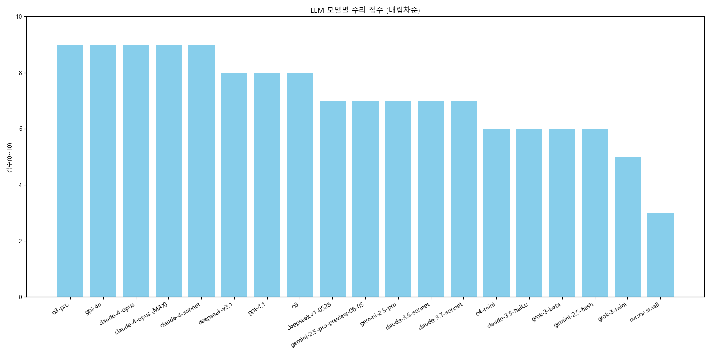
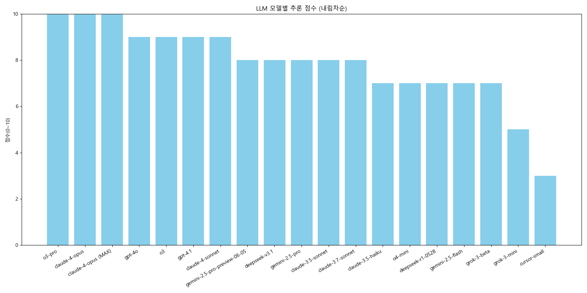
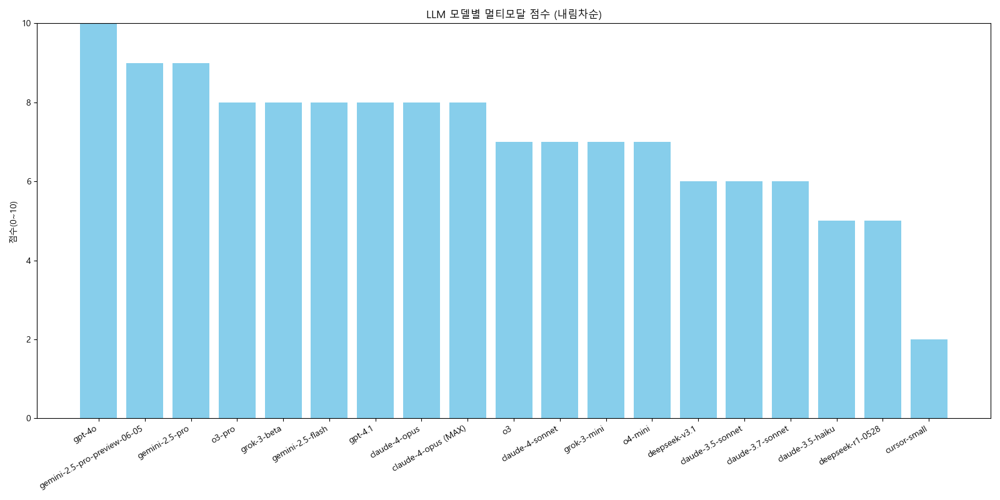
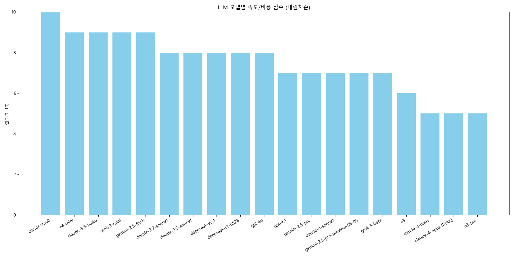

# cursor-llm-study (GitHub Pages)

최신 LLM 벤치마크, 프롬프트 엔지니어링 등 실전 자료를 한눈에!

---

## Repository 구조

- `images/` : LLM 벤치마크 등 시각화 이미지
- `codes/`  : 데이터 처리 및 시각화 코드

---

## 주요 이슈/자료

- [최신 LLM 모델별 성능 비교(2024.06) - 주요 항목별 점수 및 차트 정리](https://github.com/today-self-study/cursor-llm-study/issues/1)
- [유용한 프롬프트 엔지니어링 기법 및 Cursor Rule 등록용 예시 정리](https://github.com/today-self-study/cursor-llm-study/issues/3)

---

## LLM 항목별 벤치마크 차트

### 코딩

### 수리

### 추론

### 멀티모달

### 속도/비용

---

> 자세한 내용과 rule 예시는 위 이슈 링크를 참고하세요! 